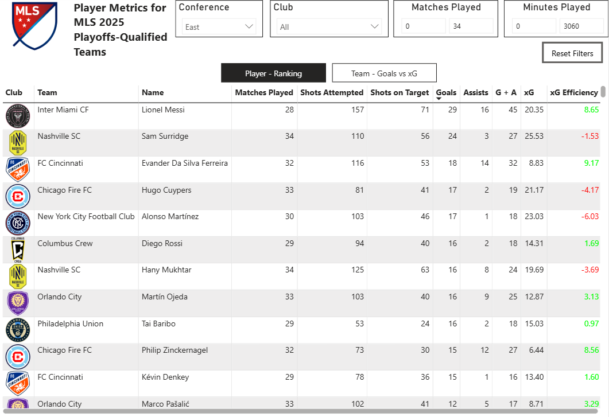
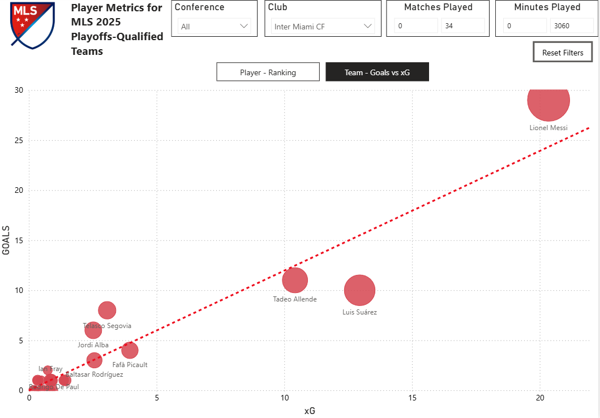

# MLS 2025 Player Analytics: Automated Web Scraping & Power BI Dashboard

## Automated Web Scraping 🔄

The data used in this project is collected through an automated web scraping process built in R. The script retrieves MLS 2025 player statistics from the MLS stats API by iterating through all available pages, converting nested JSON responses into structured tabular data, and exporting the results as CSV files. 

This process is automated using GitHub Actions, which runs the scraping script on a scheduled basis and updates the repository with the latest data for seamless integration with the Power BI dashboard.

## Dashboard Overview 📊

The report "**player_stats_viz.pbix**" includes the following visuals:

### Table Visual (Player Metrics)

A detailed table displaying:

- Matches Played

- Shots Attempted

- Shots on Target

- Goals

- Assists

- Goals + Assists (G + A)

- Expected Goals (xG)

- xG Efficiency (Goals − xG)

This table allows quick comparison of player contributions and finishing performance.
The team logos are from [**this repository**](https://github.com/DennisMorenoMax/USA-Soccer-Team-Logos)

### Scatter Plot (Goals vs xG)

A scatter chart plotting:

- X-axis: Expected Goals (xG)

- Y-axis: Goals

Each data point represents a player and is labeled with the player’s name, making it easy to identify:

Overperformers xG

Underperformers xG

### Filters & Slicers 🔍

The dashboard includes interactive slicers for:

- Conference (East / West)

- Club

- Matches Played

- Minutes Played

These allow users to dynamically explore performance across teams and player usage levels.

Maintained by Dennis Moreno

